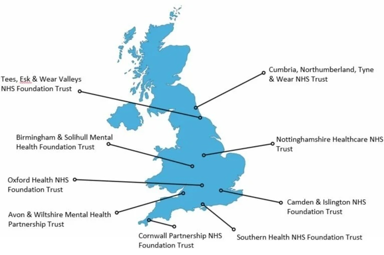

# ENHANCE Study Map Creation Instructions

## For MSE Students

### Task Overview
Create a map of ENHANCE recruiting sites in the style of `ascendtrialcoukSitesMap.jpeg` but with **LARGER, MOBILE-READABLE TEXT** and the correct ENHANCE locations.

---

## Required Specifications

### 1. Style Reference
- See `assets/ascendtrialcoukSitesMap.jpeg` for the general style
- Clean UK map silhouette in blue (#0f6a8d or similar)
- White background
- Black connector lines from locations to site names
- Small dots/circles at exact site locations

### 2. CRITICAL: Text Size for Mobile
⚠️ **The example map has text that is too small for mobile phones!**

**Required text sizes:**
- **Site names**: Minimum 18-22pt font (larger than example)
- **Font**: Sans-serif, clean, professional (e.g., Arial, Helvetica, or similar)
- **Weight**: Medium or Semi-bold for readability
- **Color**: Dark gray or black (#1f1f1f)

**Test requirement**: Text must be clearly readable on a phone screen (iPhone/Android) without zooming

### 3. Image Specifications
- **Format**: JPEG or PNG
- **Dimensions**: Minimum 1200px wide (2x display size for retina screens)
- **Aspect ratio**: Landscape (approximately 16:9 or similar)
- **File size**: Under 500KB if possible (optimize for web)
- **File name**: `enhance-sites-map.jpg` or `enhance-sites-map.png`

---

## ENHANCE Recruiting Sites to Include

Use these exact locations (coordinates from current site list):

1. **North London NHS Foundation Trust**
   - Location: Regis Road, London NW5 3EG
   - Coordinates: 51.5479, -0.1517

2. **Humber NHS Teaching Trust**
   - Location: Hull HU10 6FE
   - Coordinates: 53.754, -0.444

3. **The Rise Group Practice**
   - Location: London N19 3YU
   - Coordinates: 51.566, -0.132

4. **Mathukia Surgery**
   - Location: 281 Ilford Lane, Ilford IG1 2SF
   - Coordinates: 51.549, 0.073

5. **Knutsford Medical Partnership**
   - Location: Knutsford WA16 0LY
   - Coordinates: 53.304, -2.374

6. **Coquet Medical Group**
   - Location: Morpeth NE65 9SF
   - Coordinates: 55.338, -1.636

7. **Widdrington (Northumbria Primary Care)**
   - Location: Morpeth NE65 9PR
   - Coordinates: 55.256, -1.616

8. **Living Well Partnership**
   - Location: Hampshire SO19 9GH
   - Coordinates: 50.892, -1.364

9. **The Practice of Health**
   - Location: Barry CF63 1BA
   - Coordinates: 51.399, -3.27

10. **Llan Healthcare**
    - Location: Cardiff CF23 9PF
    - Coordinates: 51.515, -3.162

---

## Recommended Tools

### Option 1: Adobe Illustrator / Figma (Professional)
1. Import UK map vector from free sources (e.g., Wikimedia Commons)
2. Color it with ENHANCE brand color (#0f6a8d)
3. Place site markers at correct coordinates
4. Add text labels with large font (18-22pt)
5. Add connector lines
6. Export at 2x resolution (1200px+ wide)

### Option 2: PowerPoint / Keynote (Quick & Easy)
1. Insert UK map image as background
2. Add shapes (circles) for site locations
3. Add text boxes with large fonts (18-22pt)
4. Add lines connecting dots to labels
5. Export as high-resolution image (File → Export → JPEG/PNG at highest quality)

### Option 3: Google My Maps + Screenshot (Simplest but less control)
1. Create map with all sites
2. Zoom to show entire UK
3. Take high-res screenshot
4. Edit in any image editor to add labels with larger text
5. (Not recommended due to lack of text size control)

### Option 4: Python/R (For data visualization students)
```python
# Example using matplotlib/geopandas
import geopandas as gpd
import matplotlib.pyplot as plt

# Load UK shapefile
# Plot ENHANCE sites with large text annotations
# Style matching ENHANCE brand colors
```

---

## Delivery Instructions

### When Complete:
1. Save final map as `enhance-sites-map.jpg` (or `.png`)
2. Place file in `/Users/sergi/Coding/enhance-webpage/assets/` folder
3. Update `index.html` line 322-324:

**Replace:**
```html

```

**With:**
```html

```

4. **Remove the warning box** (lines 326-331)

---

## Quality Checklist

Before submitting, verify:

- [ ] All 10 sites are included with correct names
- [ ] Site locations are approximately correct on UK map
- [ ] Text is **18-22pt minimum** and clearly readable
- [ ] Text is legible on a mobile phone screen (TEST THIS!)
- [ ] Map uses ENHANCE brand color (#0f6a8d) or similar blue
- [ ] Image is at least 1200px wide
- [ ] File size is under 500KB (optimize if needed)
- [ ] Connector lines don't overlap text
- [ ] Professional, clean appearance matching ASCEND example style

---

## Questions?
Contact: Sergi / ENHANCE team

---

## Additional Notes

**Why larger text matters:**
The target audience includes people aged 60-80 with potentially lower digital literacy and vision challenges. Text that seems "readable" on a laptop will be tiny on a phone. Always test on an actual mobile device.

**Color accessibility:**
Ensure sufficient contrast between text and background (minimum 4.5:1 ratio). Use tools like WebAIM Contrast Checker if needed.

**Geographic accuracy:**
Approximate placement is fine - the goal is to show UK-wide coverage, not exact GPS coordinates.
